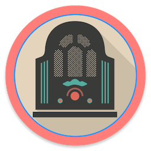
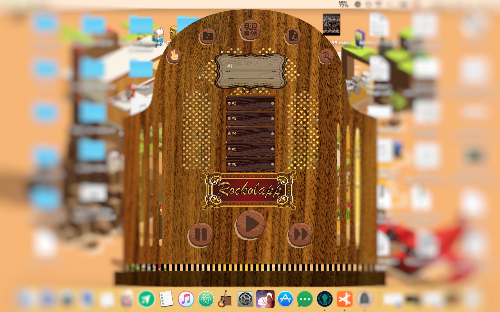

# RockolApp 

Reproduce música de archivos locales o de soundcloud. Acompañado de una aplicación móvil de la cual se puede escoger una lista de reproducción para que suene en la aplicación de escritorio. Pueden haber varias personas conectadas a la vez

Reproduces local music files or sounds from soundcloud. Works along with a mobile app from where a user can choose a playlist to play on the desktop app. Multiple people can be connected at the same time

## Screenshot

## Contributions
All contributions are welcome. Also art desing contributions or ideas.

## Install
The desktop app is a javafx app. So open it up and build it.
The android project is the Android App folder.

The connection from the mobile app to the desktop app is made through a *QR Code* generated by the desktop app and scanned by the mobile app. Both the computer running the desktop app and the mobile device must be on the same wifi network.

## License
    RockolApp/JukeboxApp -Add songs to the playlist queue of the player from the mobile app
    Copyright (C) 2016  Edgard Collante

    This program is free software: you can redistribute it and/or modify
    it under the terms of the GNU Affero General Public License as published
    by the Free Software Foundation, either version 3 of the License, or
    (at your option) any later version.

    This program is distributed in the hope that it will be useful,
    but WITHOUT ANY WARRANTY; without even the implied warranty of
    MERCHANTABILITY or FITNESS FOR A PARTICULAR PURPOSE.  See the
    GNU Affero General Public License for more details.

    You should have received a copy of the GNU Affero General Public License
    along with this program.  If not, see <http://www.gnu.org/licenses/>.